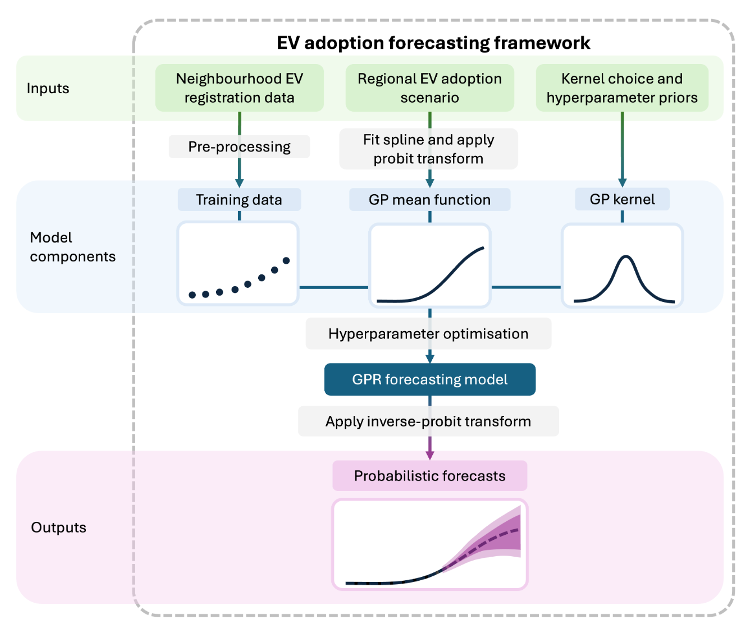
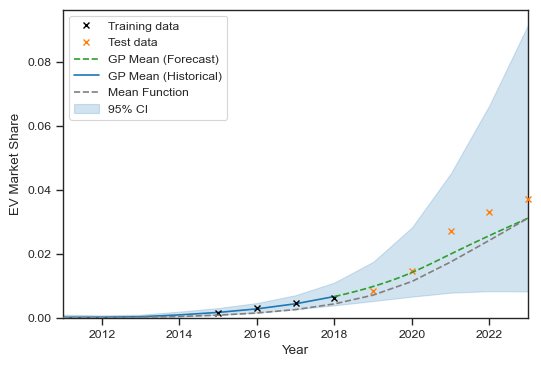
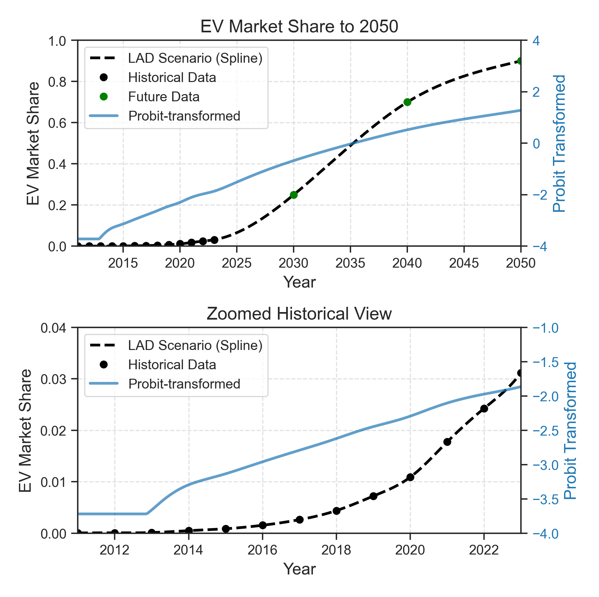

# Table of Contents
- [EV Adoption Forecasting Framework](#ev-adoption-forecasting-framework)
- [Framework Overview](#framework-overview)
- [Inputs](#inputs)
- [Model Components](#model-components)
  - [Kernel](#kernel)
  - [Mean Function](#mean-function)
  - [Training data and probit transform](#training-data-and-probit-transform)
- [Running the Code](#running-the-code)
  - [Core Framework](#core-framework)
    - [data_processing.py](#data_processingpy)
    - [model.py](#modelpy)
    - [mean_function.py](#mean_functionpy)
    - [transforms.py](#transformspy)
  - [Baselines and Validation](#baselines-and-validation)
    - [baselines.py](#baselinespy)
    - [historical_training_and_evaluation.py](#historical_training_and_evaluationpy)
- [Dependencies](#dependencies)

# EV Adoption Forecasting Framework

The **EV Adoption Forecast Framework** allows users to generate probablistic neighbourhood-level forecasts of electric vehicle (EV) adoption, within some larger region. 

The framework used Gaussian processes (GPs) to predict how neighbourhood-level EV adoption will deviate from regional trends, based on historical observations. This enables scenario-consistent forecasts that account for local variability and potential uncertainty. It allows decision-makers to ask: 

**"*If a particular regional scenario unfolds, what is the likely distribution of outcomes at the neighbourhood level?*"**

### Framework Overview
The central idea of the framework is to disaggregate regional-level EV adoption scenarios into local neighbourhoods. The diagram below provides an overview of the EV adoption forecasting framework.

### Inputs
The framework has three key inputs: (i) Neighbourhood-level EV registration data, (ii) a regional EV adoption scenario, and (iii) the choice of GP kernel and its hyperparameter priors.

The framework describes EV adoption using the proportion of registered vehicles that are EVs, referred to as *EV market share* **(EVMS)**, which is defined on the interval *[0, 1]*. 

Vehicle registration datasets used for Lower Layer Super Output Areas (LSOAs) and Local Authority Districts (LADs) in England and Wales are summarise in the table below:

| Name            | Geography | Vehicle Type       | Date Range        |
|-----------------|-----------|--------------------|-------------------|
| [VEH0105](https://www.gov.uk/government/statistical-data-sets/vehicle-licensing-statistics-data-tables)         | LAD       | All vehicles       | 2009 Q4 - 2023 Q4 |
| [VEH0142](https://www.gov.uk/government/statistical-data-sets/vehicle-licensing-statistics-data-tables)         | LAD       | BEVs and PHEVs     | 2009 Q4 - 2023 Q4 |
| [VEH0125](https://www.gov.uk/government/statistical-data-sets/vehicle-licensing-statistics-data-files)         | LSOA      | All vehicles       | 2011 Q1 - 2023 Q4 |
| [VEH0145](https://www.gov.uk/government/statistical-data-sets/vehicle-licensing-statistics-data-files)        | LSOA      | BEVs and PHEVs     | 2011 Q1 - 2023 Q4 |

The specific choice of hyperparameter priors...

### Model Components
GPs sit at the core of the framework, allowing for principled integration of spatially granular EV adoption data (as training data) and regional scenarios (as the mean function). Assumptions about future EV adoption dynamics are embedded in the GP kernel hyperparameters. There are three main components to a GP model:
1. Kernel
2. Mean function
3. Training data

#### Kernel
Selecting an appropriate kernel for a GP model is inherently subjective and can significantly impact the model’s performance and interpretability. By default, the framework uses a Radial Basis Function (RBF) kernel.

#### Mean Function
The mean function provides a foundation from which the kernel captures the latent function’s characteristics. The framework incorporates regional EV adoption scenarios as a custom mean function.

#### Training data and probit transform
The training data provides the observed evidence on which the GP is conditioned, enabling it to learn how neighbourhood-level EV adoption has historically evolved and the level of diversity across the region. 

To constrain the GP's outputs between 0 and 1, a probit transformation is applied to the training data and the custom mean function before conditioning. The inverse probit function can revert the GP output to the original EVMS domain.

# Running the Code

The `main.ipynb` notebook contains the code used for the paper: **"*A probabilistic forecasting framework for neighbourhood-level disaggregation of electric vehicle adoption scenarios.*"**, available at: (doi pending). This provides example usage of the forecasting framework.

## Dependencies
Dependencies are included in the `requirements.txt` file.

Note that `tensorflow-probability` should be set to version **0.24** to allow it to work with `tensorflow` and `gpflow`.

## Core Framework

### data_processing.py
This module contains two data processing classes specifically for UK vehicle registration data for Lower Layer Super Output Areas (LSOAs) and Local Authority Districts (LADs): `LSOAVehicleRegistrationDataProcessor` and `LADVehicleRegistrationDataProcessor`. These classes contain methods to load, filter and process the raw data into usable pandas DataFrames.

### model.py
This model defines the `GPForecastingModel` and `JointGPForecaster` classes. The framework uses GP models that are constructed with the [GPFlow](https://github.com/GPflow/GPflow) package.

The `GPForecastingModel` class is a building block for the forecasting framework. An instance of a GP forecasting model will be created for each neighbourhood. Below are the steps of using this model class:
- **Loading data**: Data for a particular neighbourhood and it's corresponding region, as well as a future regional scenario are first given to the model through the `load_data()` method. 
- **Preparing training data**: Training (and optionally testing) data is then prepared with the `prepare_train_test_data()` method which takes a dictionary for the first recorded year ($t_0$), most recent year ($t_n$) and forecasted year ($t_f$). 
- **Building the GP model**: To build the GP model, the user then must provide kernel and likelihood priors via the `build_gp_model()` method that will combine these with the training data into a single `gpflow.models.GPR` object.
- **Making a forecast**: The `make_forecast()` method uses the trained GP model to make predictions at future years.
- **Drawing forecast samples from the GP**: The `generate_sample_forecasts()` method allows users to draw sample forecasts from the trained GP.
- **Plot forecast**: The `plot_forecast()` method allows users to visualise the forecast and the prediction intervals that represent forecast uncertainty. Below is an example forecast plot.

The `JointGPForecaster` class enables the joint training of multiple `GPForecastingModel` instances. This is useful if you want to make forecasts for all neighbourhoods within a particular region.
- **Initialisation**: When creating an instance of the `JointGPForecaster` class, the forecasting model class (`GPForecastingModel`), region, data, scenarios and priors are all specified.
- **Training**: The models are then jointly trained (one set of hyperparameter values are learned for the whole region) using the `train()` method.
- **Making forecasts**: The `run_forecasts()` method is used to produce mean forecasts and their associated variance.
- **Drawing forecast samples**: Samples are drawn from the collection of GP models using the `generate_forecast_samples()` method.

### mean_function.py
This module defines a `Spline` and `CustomMeanFunction` class. To create a custom mean function from discrete data points, a spline is fitted to the regional EV adoption scenario.

### transforms.py
This module defines the `probit()` and `invprobit()` functions used to transform the data. The figure below shows how the probit transform affects the spline-fitted mean function. This converts the regional scenario into a smooth function which can then be used as a custom mean function in a `gpflow.models.GPR` object.

## Baselines and validation
The following modules were developed for the purposes of benchmarking and evaluating the frameworks historical forecasting performance.

### baselines.py
This module contains a number of classes relevant to baseline forecasting models, used as benchmarks to test the forecastinf framework's forecasting accuracy against. These include:
- A `BaselineForecaster` class 
- A `BaselineEvaluator` class
- A `BaselineNMAEComparator` class
- A `ScaledScenario` class
- A `LogisticGrowthModel` class

### historical_training_and_evaluation.py
This module contains the `GPForecastValidator` class that is used to automate the training and evaluation fo multiple `JointGPForecaster` instances.
